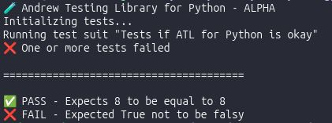

<center></center>

## SETTING ANDREW TESTING LIBRARY FOR PYTHON UP

> Download the latest version Andrew Testing Library for Python [here](https://github.com/Redwars22/andrew-testlib-py/releases), extract it somewhere inside the folder of your project and then create a folder named **test** and a file named **example.test.py**, then proceed to the next section.

### WRITING YOUR FIRST TEST

Paste the following code into the example.spec.ts file then save it.

```py
from andtlib import AndrewTestingLibrary

test = AndrewTestingLibrary("Checks if the sum of two numbers is equal to 8")
test.start()

num1 = 4
num2 = 4
sum = num1 + num2

test.shouldBeEqual(sum, 8)
test.stop()
```

The test above checks whether the sum of two numbers is equal to 8. Now open your terminal at the folder where you saved your test and type `python example.test.py`. You should get the following output in the terminal:



When you create a new object of the AndrewTestingLibrary class, you pass to the constructor the name of your test suite as its argument.

## MATCHERS

- **shouldBeEqual**
- **shouldNotBeEqual**
- **shouldBeStrictEqual**
- **shouldBeNull**
- **shouldNotBeNull**
- **shouldBeUndefined**
- **shouldNotBeUndefined**
- **shouldBeTruthy**
- **shouldBeFalsy**

### MATCHERS FOR NUMBERS

- **shouldBeGreaterThan**
- **shouldBeGreaterOrEqual**
- **shouldBeLessThan**
- **shouldBeLessOrEqual**

### MATCHERS FOR COMPARING ARRAYS/LISTS

- **shouldBeEqualArr** (for *arrays/lists*)
